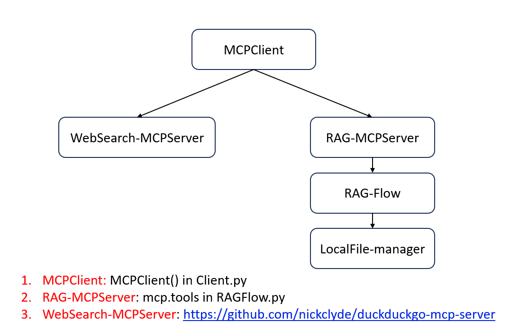

# 项目环境配置指南
## 项目框架

## 环境准备

### 1. 激活 Conda 环境
```bash
conda create --name myenv python=3.12

conda activate myenv
```

### 2. 安装依赖包
```bash
cd MCPAgent

pip install -r requirements.txt
```

### 3. 部署 DuckDuckGo MCP 服务器
预先部署 [DuckDuckGo MCP Server](https://github.com/nickclyde/duckduckgo-mcp-server)，以便 Python 程序后续调用。


## 使用说明见视频